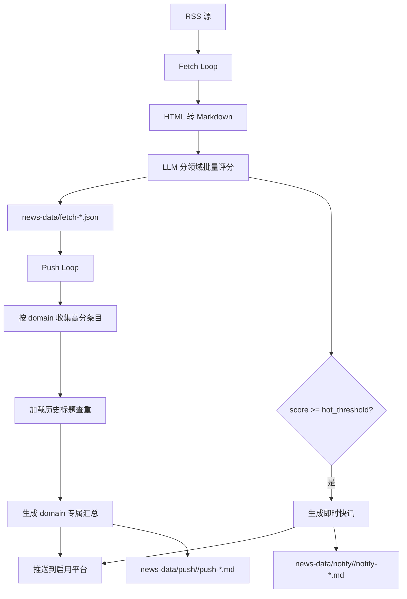

<h1 align="center">AI Daily 每日资讯推送系统</h1>


<p align="center">AI 驱动的 RSS 新闻聚合与分领域推送系统 | 支持 400+ 信息源 | LLM 批量评分 | 推送到 Discord/飞书/Gmail</p>

## 核心功能

- **RSS 聚合**：从 `resources/rss.opml` 和自定义 RSS 源抓取内容，支持源级屏蔽和域名通配符屏蔽。
- **分领域评分**：LLM 按 `AI`、`Investment` 等启用领域批量评分，并写入 `domain`、`score`、`tags`、`summary`。
- **即时推送**：达到 `hot_threshold` 的热点内容会立即生成快讯，避免错过高价值信息。
- **定时汇总**：按 cron 时间把近期高分内容按 domain 独立生成日报/投资摘要。
- **多平台推送**：支持 Discord Webhook、飞书机器人和 Gmail SMTP。
- **本地归档**：抓取、即时推送和汇总推送都会保存在 `news-data/`，方便追溯和查重。

## 快速开始

### 环境要求

- Python 3.10+

### 1. 创建虚拟环境

```bash
python -m venv .venv
source .venv/bin/activate
```

Windows:

```bash
.venv\Scripts\activate
```

### 2. 安装依赖

```bash
pip install -r requirements.txt
```

### 3. 配置环境变量

在项目根目录创建 `.env` 文件。默认 `config.json` 使用 OpenAI 兼容接口，并从 `OPENAI_API_KEY` 读取密钥：

```bash
# LLM API（OpenAI API 兼容接口）
OPENAI_API_KEY=your_api_key_here

# Gmail SMTP
GMAIL_USERNAME=your_email@gmail.com
GMAIL_APP_PASSWORD=your_16_digit_app_password
GMAIL_TO=receiver@example.com

# Discord Webhook（可选）
# DISCORD_WEBHOOK_URL=https://discord.com/api/webhooks/...

# 飞书 Webhook（可选）
# FEISHU_WEBHOOK_URL=https://open.feishu.cn/open-apis/bot/v2/hook/...
```

如果你使用 OpenRouter、OpenAI 或其他兼容服务，只需要同步修改 `config.json` 中的 `llm.baseUrl`、`llm.model` 和 `llm.apiKeyName`。

### 4. 检查配置

当前配置示例：

```json
{
  "llm": {
    "provider": "openai",
    "model": "qwen3.5-flash",
    "baseUrl": "https://dashscope.aliyuncs.com/compatible-mode/v1",
    "apiKeyName": "OPENAI_API_KEY",
    "max_prompt_chars": 20000,
    "max_concurrent_batches": 2,
    "max_retries": 3,
    "prompts": {
      "domain": {
        "activity_domains": ["AI", "Investment"],
        "domains": [
          {
            "key": "AI",
            "score_standard": "prompts/score/ai/score_standard.md",
            "digest": "prompts/digest/ai/digest.md",
            "immediate_push": "prompts/immediate/ai/immediate_push.md"
          },
          {
            "key": "Investment",
            "score_standard": "prompts/score/investment/score_standard.md",
            "digest": "prompts/digest/investment/digest.md",
            "immediate_push": "prompts/immediate/investment/immediate_push.md"
          }
        ]
      },
      "score_batch": "prompts/score/score_batch.md"
    }
  },
  "push": {
    "discord": {
      "enabled": false,
      "apiKeyName": "DISCORD_WEBHOOK_URL"
    },
    "feishu": {
      "enabled": false,
      "apiKeyName": "FEISHU_WEBHOOK_URL"
    },
    "gmail": {
      "enabled": true,
      "usernameKeyName": "GMAIL_USERNAME",
      "passwordKeyName": "GMAIL_APP_PASSWORD",
      "toKeyName": "GMAIL_TO",
      "fromName": "AI Daily"
    }
  }
}
```

### 5. 运行程序

```bash
python -m src.main
```

首次运行会自动创建 `news-data/` 目录。启动时会先检查 LLM 接口可用性，检查失败则退出。

也可以使用 Docker：

```bash
docker compose up -d --build
```

## 配置详解

### sources - 订阅源管理

| 字段 | 类型 | 说明 |
|------|------|------|
| `base_opml` | string | 基础 OPML 文件路径，默认 `resources/rss.opml` |
| `add` | array | 自定义添加的 RSS 源，结构为 `{title, xmlUrl, category}` |
| `block` | array | 手动屏蔽的 RSS 源，按 `xmlUrl` 精确匹配 |
| `block_domains` | array | 域名屏蔽，支持 `*.substack.com` 这类通配符 |

### filter - 内容过滤

| 字段 | 类型 | 说明 |
|------|------|------|
| `min_score` | number | 定时汇总最低评分阈值 |
| `hot_threshold` | number | 即时推送阈值 |
| `context_days` | number | 汇总和即时推送查重时读取的近期天数 |
| `keep_days` | number | `news-data/` 旧文件保留天数 |
| `push_context_days` | number | 定时汇总读取历史推送标题的天数 |
| `no_content_marker` | string | LLM 判定无新内容时返回的标记，默认 `[NO_NEW_CONTENT]` |

### schedule - 调度配置

| 字段 | 类型 | 说明 |
|------|------|------|
| `fetch_interval_minutes` | number | RSS 抓取间隔，单位分钟 |
| `fetch_lookback_minutes` | number | 抓取回看窗口，必须不小于抓取间隔，用于降低 RSS 延迟漏读 |
| `push_cron` | array | 定时推送 cron 表达式数组 |
| `timezone_hours` | number | 展示和归档使用的时区偏移，`8` 表示 UTC+8 |

当前默认推送时间：

| 表达式 | 含义 |
|--------|------|
| `0 8 * * *` | 每天 08:00 |
| `40 16 * * *` | 每天 16:40 |

cron 格式：`minute hour day month weekday`。

### fetch - 抓取配置

| 字段 | 类型 | 说明 |
|------|------|------|
| `max_workers` | number | 并发抓取 RSS 源数量 |
| `timeout` | number | 单个 RSS 请求超时时间，单位秒 |

### llm - 大语言模型配置

| 字段 | 类型 | 说明 |
|------|------|------|
| `provider` | string | 供应商标识；当前调用统一走 OpenAI 兼容接口 |
| `model` | string | 模型名称 |
| `baseUrl` | string | OpenAI 兼容接口地址，不包含 `/chat/completions` |
| `apiKeyName` | string | API Key 所在环境变量名 |
| `max_prompt_chars` | number | 单个批次 prompt 最大字符数 |
| `max_concurrent_batches` | number | 批量评分最大并发批次数 |
| `max_retries` | number | LLM 请求失败后的最大重试次数 |
| `prompts.score_batch` | string | 批量评分 prompt 路径 |
| `prompts.domain.activity_domains` | array | 当前启用的领域列表 |
| `prompts.domain.domains[]` | array | 每个领域的评分标准、汇总和即时推送 prompt 配置 |

### push - 推送平台配置

| 字段 | 类型 | 说明 |
|------|------|------|
| `discord.enabled` | boolean | 是否启用 Discord 推送 |
| `discord.apiKeyName` | string | Discord Webhook 环境变量名 |
| `feishu.enabled` | boolean | 是否启用飞书推送 |
| `feishu.apiKeyName` | string | 飞书 Webhook 环境变量名 |
| `gmail.enabled` | boolean | 是否启用 Gmail SMTP 推送 |
| `gmail.usernameKeyName` | string | Gmail 发件账号环境变量名 |
| `gmail.passwordKeyName` | string | Gmail App Password 环境变量名 |
| `gmail.to` | string/array | 收件人邮箱，可直接写配置 |
| `gmail.toKeyName` | string | 收件人邮箱环境变量名，未配置 `to` 时使用 |
| `gmail.cc` / `gmail.bcc` | string/array | 可选抄送/密送邮箱 |
| `gmail.fromName` | string | 发件人显示名称 |
| `gmail.smtpHost` | string | SMTP 地址，默认 `smtp.gmail.com` |
| `gmail.smtpPort` | number | SMTP 端口，默认 `587` |
| `gmail.useTLS` / `gmail.useSSL` | boolean | STARTTLS 或 SSL 开关 |

Gmail 会发送 `multipart/alternative` 邮件：纯文本部分保留 Markdown，HTML 部分渲染为可读邮件正文。

## 工作流程



## 数据文件

### `news-data/fetch-*.json`

```json
{
  "meta": { "date": "2026-05-26" },
  "entries": [
    {
      "title": "Sample model release",
      "link": "https://example.com/model-release",
      "published": "2026-05-26T08:10:00+08:00",
      "fetched_at": "2026-05-26T08:30:05+08:00",
      "source": "Example Feed",
      "content": "...",
      "tags": ["模型", "发布"],
      "domain": "AI",
      "score": 88,
      "summary": "某模型发布并公布关键能力。"
    }
  ]
}
```

### `news-data/notify/<domain>/notify-*.md`

即时推送按 domain 和日期追加保存，每个推送块包含 `pushTime` 与 `domain` frontmatter，并用 `------` 分隔。

### `news-data/push/<domain>/push-*.md`

```markdown
---
pushDate: "2026-05-26T16:40:05+08:00"
domain: "AI"
sourceCount: 8
totalEntries: 8
---

# AI Daily AI精选 | 2026-05-26
```

## 测试

运行主流程轻量测试：

```bash
pytest tests/test_flow.py -v
```

`tests/test_flow.py` 默认读取根目录 `config.json`，覆盖配置接口、RSS 源合并、HTML 转 Markdown、fake LLM 评分、domain digest、存储筛选和 Gmail 邮件构建。

真实 RSS、LLM 和推送调试默认关闭。需要调试时直接修改 `tests/test_flow.py` 顶部开关：

```python
RUN_REAL_RSS_FETCH = True
RUN_REAL_LLM_SCORE = True
RUN_REAL_LLM_DIGEST = True
RUN_REAL_PUSH = True
DEBUG_DOMAIN = "AI"
```

## 扩展指南

### 添加 RSS 源

```json
"sources": {
  "add": [
    {
      "title": "OpenAI News",
      "xmlUrl": "https://openai.com/news/rss.xml",
      "category": "AI"
    }
  ]
}
```

### 添加新的领域

1. 在 `prompts/score/<domain>/score_standard.md` 写评分标准。
2. 在 `prompts/digest/<domain>/digest.md` 写该领域的汇总 prompt。
3. 在 `prompts/immediate/<domain>/immediate_push.md` 写该领域的即时推送 prompt。
4. 在 `config.json` 的 `llm.prompts.domain.domains` 增加 `{key, score_standard, digest, immediate_push}`。
5. 把 `key` 加入 `llm.prompts.domain.activity_domains`。

### 添加新的推送平台

1. 在 `src/push/` 创建新平台文件，继承 `PushPlatform`。
2. 实现 `validate_config()` 和 `send()`。
3. 在 `src/push/__init__.py` 的 `create_platform()` 中注册。

### 修改评分逻辑

- 通用评分输出格式：`prompts/score/score_batch.md`
- AI 评分标准：`prompts/score/ai/score_standard.md`
- 投资评分标准：`prompts/score/investment/score_standard.md`

## 常见问题

### 如何只抓取不推送？

把所有推送平台的 `enabled` 改为 `false`。抓取结果仍会写入 `news-data/fetch-*.json`。

### LLM API 配额不足怎么办？

- 增大 `schedule.fetch_interval_minutes`
- 减小 `fetch.max_workers`
- 减小 `llm.max_concurrent_batches`
- 提高 `filter.min_score`，减少定时汇总内容

### 即时推送没有触发？

检查：

1. `filter.hot_threshold` 是否过高。
2. 抓取结果中是否有条目的 `score` 达到阈值。
3. 推送内容是否被 LLM 判定为重复并返回 `[NO_NEW_CONTENT]`。
4. 推送平台是否启用且环境变量存在。

### 定时推送没有收到？

检查：

1. `schedule.push_cron` 是否有效。
2. `schedule.timezone_hours` 是否符合你的时区。
3. `news-data/push/<domain>/` 下是否生成了 Markdown 文件。
4. 日志中是否出现推送平台错误。

## 目录结构

```text
ai-daily/
├── src/
│   ├── main.py          # 入口 + fetch/push 双循环
│   ├── config.py        # 配置加载、OPML 解析、源合并
│   ├── fetcher.py       # RSS 抓取
│   ├── llm.py           # LLM 评分、即时推送、domain 汇总
│   ├── processor.py     # HTML 转 Markdown
│   ├── storage.py       # JSON/Markdown 数据读写
│   └── push/
│       ├── base.py
│       ├── discord.py
│       ├── feishu.py
│       └── gmail.py
├── prompts/
│   ├── immediate/
│   │   ├── ai/immediate_push.md
│   │   └── investment/immediate_push.md
│   ├── score/
│   │   ├── score_batch.md
│   │   ├── ai/score_standard.md
│   │   └── investment/score_standard.md
│   └── digest/
│       ├── ai/digest.md
│       └── investment/digest.md
├── tests/
│   └── test_flow.py
├── resources/
│   └── rss.opml
├── config.json
├── docker-compose.yml
├── Dockerfile
└── requirements.txt
```

## RSS 源说明

`resources/rss.opml` 包含约 420 个订阅源，初始整理自 [ginobefun/BestBlogs](https://github.com/ginobefun/BestBlogs)。你可以通过 `sources.add`、`sources.block` 和 `sources.block_domains` 在不修改 OPML 的情况下增删源。

## License

MIT License - see [LICENSE](LICENSE) file for details.
