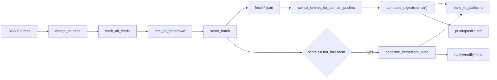

# 技术架构

## 核心架构

AI Daily 使用两个长期运行的异步循环：

- **Fetch Loop**：按固定间隔抓取 RSS，转换内容、批量评分、保存抓取结果，并处理高分即时推送。
- **Push Loop**：按 `schedule.push_cron` 计算下一次触发时间，按 domain 生成定时汇总并推送。
- **Source Sync Loop**：按 `sources.sync.cron` 每周拉取远端 OPML，合并去重后替换本地 `resources/rss.opml`。

```text
┌──────────────────────────────────────────────────────────────┐
│                     Config (config.yaml)                     │
├──────────────────────────────────────────────────────────────┤
│ sources        filter        schedule       llm/prompts/push │
│ base_opml      min_score     fetch interval domain prompts   │
│ add/block      threshold     push_cron      platforms        │
└──────────────────────────────────────────────────────────────┘
                            │
           ┌────────────────┴────────────────┐
           ▼                                 ▼
┌─────────────────────┐           ┌─────────────────────┐
│ Fetch Loop          │           │ Push Loop           │
│ fixed interval      │           │ croniter schedule   │
│                     │           │                     │
│ - fetch RSS         │           │ - collect entries   │
│ - HTML to Markdown  │           │ - group by domain   │
│ - score batch       │           │ - compose digest    │
│ - instant push      │           │ - push and archive  │
└─────────────────────┘           └─────────────────────┘
           │                                 │
           └────────────────┬────────────────┘
                            ▼
                 ┌─────────────────────┐
                 │ news-data/          │
                 │ fetch-*.json        │
                 │ notify/<domain>/*.md│
                 │ push/<domain>/*.md  │
                 └─────────────────────┘
```

## 数据流


```mermaid
flowchart LR
    A["RSS Sources"] --> B["merge_sources"]
    B --> C["fetch_all_feeds"]
    C --> D["html_to_markdown"]
    D --> E["score_batch"]
    E --> F["fetch-*.json"]
    E --> G{"score >= hot_threshold"}
    G -->|yes| H["generate_immediate_push"]
    H --> I["send_to_platforms"]
    H --> J["notify/<domain>/notify-*.md"]
    F --> K["collect_entries_for_domain_pushes"]
    K --> L["compose_digest(domain)"]
    L --> I
    L --> M["push/<domain>/push-*.md"]
```

## 关键模块

### `src/main.py`

职责：

- 加载 `.env` 和 `config.yaml`
- 启动前调用 `check_llm_available()` 检查 LLM 可用性
- 并发启动 `fetch_loop()` 和 `push_loop()`
- 统一处理 LLM 异常通知

关键流程：

```python
initialize_config()
await check_llm_available()
await asyncio.gather(fetch_loop(), push_loop())
```

`run_fetch_job()`：

1. 根据 `fetch_interval_minutes` 和 `fetch_lookback_minutes` 计算 UTC 抓取窗口。
2. 合并 OPML 与自定义源，应用 `block` 和 `block_domains`。
3. 并发抓取 RSS，转换 HTML 为 Markdown。
4. 基于近期已保存链接去重。
5. 调用 `score_batch()` 分领域批量评分。
6. 保存到 `news-data/fetch-YYYY-MM-DD.json`。
7. 对达到 `hot_threshold` 的条目按 domain 生成即时快讯，推送并追加到 `notify/<domain>/notify-YYYY-MM-DD.md`。

`run_push_job()`：

1. 调用 `collect_entries_for_domain_pushes()` 按 domain 收集候选内容。
2. 每个 domain 独立读取上次 push 时间，并以 24 小时窗口作为兜底边界。
3. 加载该 domain 近期 push 标题作为查重上下文。
4. 调用 `compose_digest(..., domain=domain)` 使用 domain 专属 prompt 生成汇总。
5. 推送到启用平台，并保存到 `news-data/push/<domain>/push-*.md`。

### `src/config.py`

职责：

- 用 Pydantic 模型描述整份配置：`AppConfig` 是根模型，下辖 `FilterConfig`、`DedupeConfig`、`ScheduleConfig`、`FetchConfig`、`LLMConfig`、`PushConfig`、`SourcesConfig`。
- `load_config()` 用 `yaml.safe_load()` 读取 `config.yaml`，再交给 `AppConfig.model_validate()` 校验，返回类型化对象，业务代码统一用属性访问（`config.llm.model`）。
- `initialize_config()` 在启动时只加载一次并保存全局只读 `AppConfig`；`get_config()` 在业务模块中读取它，避免配置对象沿调用链传递。
- `get_timezone()` 只从已初始化的全局配置读取时区。
- `parse_opml()` 解析 OPML 订阅源。
- `merge_sources()` 合并 `base_opml + add - block`，并按 `xmlUrl` 去重。
- `source_sync.sync_opml_sources()` 下载 `sources.sync.urls` 中的远端 OPML，解析 RSS outline，按 `xmlUrl` 去重，并在所有远端源都成功时原子替换 `base_opml`。
- `block_domains` 支持 `*.substack.com` 形式，也支持 `fnmatch` 通配。
- `get_timezone()` 使用必填的 `schedule.timezone_hours`，不会回退到系统本地时区。

### `src/fetcher.py`

职责：

- 使用 `aiohttp` 并发抓取 RSS。
- 使用浏览器风格请求头降低 403 概率。
- 使用 `feedparser` 解析条目。
- RSS 时间统一解析为 UTC `datetime`，抓取过滤也基于 UTC。

输出条目基础结构：

```json
{
  "title": "无标题",
  "link": "",
  "published": "datetime",
  "source": "Feed Title",
  "content": "",
  "tags": [],
  "score": 0,
  "summary": ""
}
```

### `src/processor.py`

职责：

- 使用 `markdownify` 把 RSS HTML 正文转 Markdown。
- 根据原始链接补全相对链接和图片地址。
- 移除 `xgo.ing` 推广链接。
- 清理多余空行。

### `src/llm.py`

LLM 调用统一使用 OpenAI 兼容接口：

```python
url = f"{base_url}/chat/completions"
payload = {
    "model": model,
    "messages": [{"role": "user", "content": prompt}],
    "temperature": 0.3,
}
```

`call_llm()` 支持：

- 从 `apiKeyName` 指定的环境变量读取密钥。
- 通过可选 `response_format` 透传 OpenAI 兼容 JSON mode 等结构化输出配置。
- `max_retries` 控制重试次数。
- 对 `404, 429, 500, 502, 503, 504` 做指数退避重试。

`score_batch(entries, config)`：

1. 读取 `prompts.score_batch`。
2. 从 `prompts.domain.activity_domains` 构建可选领域列表。
3. 读取启用 domain 的 `score_standard`，拼进评分 prompt。
4. 根据 `max_prompt_chars` 自动分批。
5. 使用 `max_concurrent_batches` 控制并发。
6. 评分调用传入 `response_format={"type": "json_object"}`，优先解析 `{"items": [...]}`，并兼容旧式顶层 JSON 数组。
7. 当返回数量异常时，保留可按 `link` 匹配的结果，同时返回错误列表。

`generate_immediate_push()`：

- 必须传入 `domain`。
- 通过 `llm.prompts.domain.domains[].immediate_push` 查找 domain 专属即时推送 prompt。
- 传入本次热点条目和近期 notify/push 标题。
- 待推送条目会移除 `summary` 字段；当 `content` 为空时，用评分阶段生成的 `summary` 补充到 `content`。
- 失败时返回空内容和错误信息，由调用方告警并跳过本次即时推送。

`compose_digest()`：

- 必须传入 `domain`。
- 通过 `llm.prompts.domain.domains[].digest` 查找 domain 专属汇总 prompt。
- 未配置对应 digest 时直接报错。
- 传入待推送条目、历史上下文和近期 push 标题；待推送条目同样会移除 `summary` 字段，并在正文为空时用 `summary` 补充 `content`。

### `src/storage.py`

主要文件：

| 文件 | 说明 |
|------|------|
| `news-data/fetch-YYYY-MM-DD.json` | 当天抓取和评分结果 |
| `news-data/notify/<domain>/notify-YYYY-MM-DD.md` | 当天即时推送内容，按 domain 分目录并按块追加 |
| `news-data/push/<domain>/push-YYYY-MM-DD-HH-MM-SS.md` | 定时汇总推送归档 |

`fetch-*.json` 格式：

```json
{
  "meta": { "date": "2026-05-26" },
  "entries": [
    {
      "title": "...",
      "link": "...",
      "published": "...",
      "fetched_at": "...",
      "source": "...",
      "content": "...",
      "tags": ["..."],
      "domain": "AI",
      "score": 85,
      "summary": "..."
    }
  ]
}
```

`push-*.md` frontmatter：

```yaml
---
pushDate: "2026-05-26T16:40:05+08:00"
domain: "AI"
sourceCount: 8
totalEntries: 8
---
```

去重与上下文：

- `load_existing_links()` 在跨天边界会读取昨天和今天的 fetch 文件，降低重复抓取。
- `load_recent_notify_titles()` 按 domain 只提取即时推送标题供 LLM 查重。
- `load_recent_push_titles()` 只提取历史汇总标题供 LLM 查重。
- 传给 LLM 的历史推送上下文是标题清单，不把完整成品文案传回去模仿。

### `src/push/`

平台注册入口是 `create_platform()`：

```python
platforms = {
    "discord": DiscordPlatform,
    "feishu": FeishuPlatform,
    "gmail": GmailPlatform,
}
```

| 平台 | 行为 |
|------|------|
| Discord | Webhook 发送纯文本，按 2000 字符切分 |
| 飞书 | 发送 V2 interactive card，Markdown 元素按 8000 字符切分 |
| Gmail | SMTP 发送 `multipart/alternative` 邮件，Markdown + HTML 双正文 |

`send_to_platforms()` 从全局 `AppConfig` 遍历 `push_config.enabled_platforms()`，只发送到 `enabled=true` 的平台；`create_platform()` 在平台所需环境变量缺失时返回 `None` 并跳过。单个平台失败只打印错误，不中断其他平台。

## 配置详解

配置文件是根目录的 `config.yaml`，由 `load_config()` 用 `yaml.safe_load()` 读取，并用 Pydantic 模型 `AppConfig` 校验。

校验规则：

- 所有字段都是必填，代码中不设默认值，配置里缺什么就报什么。
- 禁止未知字段（`extra="forbid"`），拼错的键名会直接报错而不是被忽略。
- 值域约束：分数类字段限定 `0-100`，时长与并发类字段必须大于 0，`timezone_hours` 限定 `-12` 到 `14`。
- 语义约束：`hot_threshold` 不得低于 `min_score`；`push_cron` 与 `sources.sync.cron` 必须是合法 cron；`hot_push_block_periods` 每段起始时间必须早于结束时间；`llm.baseUrl`、`sources.add[].xmlUrl`、`sources.sync.urls` 必须是 http/https URL；`activity_domains` 中的 domain 必须在 `prompts.domain.domains` 里配好 prompt；`sources.sync.enabled=true` 时 `urls` 不能为空。
- 初始化时还会解析相对路径并检查 prompt 与 `base_opml` 文件可读，避免进入循环后才失败。

配置文件缺失、YAML 语法错误、顶层不是映射，或任一字段校验失败时，`load_config()` 会用 `logging` 打印失败原因和逐条问题位置，然后 `sys.exit(1)` 退出，不进入主流程。

顶层结构：

```yaml
filter:
  min_score: 60
  hot_threshold: 90
  context_days: 2
  keep_days: 7
  push_context_days: 5
  no_content_marker: "[NO_NEW_CONTENT]"

dedupe:
  fuzzy_enabled: false
  content_threshold: 90

schedule:
  fetch_interval_minutes: 120
  fetch_lookback_minutes: 180
  push_cron:
    - "30 9 * * *"
  hot_push_block_periods:
    - ["01:00", "09:31"]
  timezone_hours: 8

fetch:
  max_workers: 10
  timeout: 10
llm:
  provider: openai
  model: gpt-5.6-luna
  baseUrl: https://www.rightapi.ai/codex/v1
  apiKeyName: RIGHT_CODE_API_KEY
  max_prompt_chars: 64000
  digest_max_input_tokens: 450000
  max_concurrent_batches: 3
  max_retries: 3
  startup_timeout_seconds: 15
  prompts:
    domain:
      activity_domains:
        - AI
        - Investment
      domains:
        - key: AI
          score_standard: prompts/score/ai/score_standard.md
          digest: prompts/digest/ai/digest.md
          immediate_push: prompts/immediate/ai/immediate_push.md
        - key: Investment
          score_standard: prompts/score/investment/score_standard.md
          digest: prompts/digest/investment/digest.md
          immediate_push: prompts/immediate/investment/immediate_push.md
    score_batch: prompts/score/score_batch.md
push:
  discord:
    enabled: false
    apiKeyName: DISCORD_WEBHOOK_URL
  feishu:
    enabled: false
    apiKeyName: FEISHU_WEBHOOK_URL
  gmail:
    enabled: true
    usernameKeyName: GMAIL_USERNAME
    passwordKeyName: GMAIL_APP_PASSWORD
    to: []
    toKeyName: GMAIL_TO
    cc: []
    bcc: []
    fromName: AI Daily
    subject: AI Daily
    smtpHost: smtp.gmail.com
    smtpPort: 587
    useTLS: true
    useSSL: false
    timeout: 30

sources:
  base_opml: resources/rss.opml
  sync:                 # 每周拉取远端 OPML 覆盖 base_opml
    enabled: true
    cron: "0 4 * * 0"
    backup: true
    timeout: 30
    title: AI Daily RSS Sources
    urls:
      - https://raw.githubusercontent.com/.../feeds.opml
  add:                  # 自定义补充源
    - title: OpenAI News
      xmlUrl: https://openai.com/news/rss.xml
      category: AI
  block:                # 按 xmlUrl 屏蔽
    - xmlUrl: https://dev.to/feed
  block_domains:        # 按域名屏蔽，支持 *.example.com
    - "*.youtube.com"
```

### 环境变量

| 配置项 | 环境变量示例 | 说明 |
|--------|--------------|------|
| LLM API Key | `OPENAI_API_KEY` | 由 `llm.apiKeyName` 指定，可改成任意变量名 |
| Discord Webhook | `DISCORD_WEBHOOK_URL` | 由 `push.discord.apiKeyName` 指定 |
| 飞书 Webhook | `FEISHU_WEBHOOK_URL` | 由 `push.feishu.apiKeyName` 指定 |
| Gmail 发件账号 | `GMAIL_USERNAME` | 由 `push.gmail.usernameKeyName` 指定 |
| Gmail App Password | `GMAIL_APP_PASSWORD` | 由 `push.gmail.passwordKeyName` 指定 |
| Gmail 收件人 | `GMAIL_TO` | 由 `push.gmail.toKeyName` 指定 |

## 目录结构

```text
ai-daily/
├── src/
│   ├── main.py
│   ├── config.py
│   ├── fetcher.py
│   ├── llm.py
│   ├── processor.py
│   ├── storage.py
│   └── push/
│       ├── __init__.py
│       ├── base.py
│       ├── discord.py
│       ├── feishu.py
│       └── gmail.py
├── prompts/
│   ├── immediate/
│   │   ├── ai/immediate_push.md
│   │   └── investment/immediate_push.md
│   ├── score/
│   │   ├── score_batch.md
│   │   ├── ai/score_standard.md
│   │   └── investment/score_standard.md
│   └── digest/
│       ├── ai/digest.md
│       └── investment/digest.md
├── tests/
│   └── test_flow.py
├── resources/
│   └── rss.opml
├── news-data/
│   ├── fetch-*.json
│   ├── notify/<domain>/notify-*.md
│   └── push/<domain>/push-*.md
├── config.yaml
├── requirements.txt
├── Dockerfile
└── docker-compose.yml
```

## 扩展指南

### 添加新推送平台

1. 在 `src/push/` 创建新文件。
2. 继承 `PushPlatform`。
3. 实现 `validate_config()` 和 `send()`。
4. 在 `src/push/__init__.py` 的 `create_platform()` 中注册。

### 添加新 domain

1. 新增评分标准文件，例如 `prompts/score/<domain>/score_standard.md`。
2. 新增摘要 prompt，例如 `prompts/digest/<domain>/digest.md`。
3. 新增即时推送 prompt，例如 `prompts/immediate/<domain>/immediate_push.md`。
4. 在 `config.yaml` 的 `llm.prompts.domain.domains` 中添加配置。
5. 在 `llm.prompts.domain.activity_domains` 中启用该 domain。

### 添加新源

编辑 `config.yaml` 的 `sources.add` 列表。需要屏蔽源时优先使用 `sources.block` 或 `sources.block_domains`，避免直接改 OPML。

## 测试指南

```bash
pytest tests/test_flow.py -v
```

`tests/test_flow.py` 默认读取根目录 `config.yaml`，保持测试和真实配置接口一致。它覆盖主流程中的主要步骤：

| 步骤 | 测试内容 |
|------|----------|
| 配置 | 真实 `config.yaml` 能通过模型校验，启用 domain 的 prompt 文件可访问 |
| 配置容错 | 文件缺失、YAML 非法、缺少字段、值越界、未知字段时 `load_config()` 退出并打印错误日志 |
| 抓取前处理 | 合并 RSS 源、去重、屏蔽源、HTML 转 Markdown |
| LLM 评分 | 使用 fake LLM 返回 JSON，验证评分、domain、summary 合并 |
| Digest | 使用 fake LLM 验证 domain digest prompt 可调用 |
| 存储和筛选 | 写入临时 fetch 文件，再按分数、domain、时间筛出待推送和上下文 |
| 推送 | 基于 `config.yaml` 的 Gmail 配置构建邮件消息，不发送真实邮件 |

真实服务测试默认关闭。需要调试时直接改 `tests/test_flow.py` 顶部变量：

```python
RUN_REAL_RSS_FETCH = True
RUN_REAL_LLM_SCORE = True
RUN_REAL_LLM_DIGEST = True
RUN_REAL_PUSH = True
DEBUG_DOMAIN = "AI"
```
