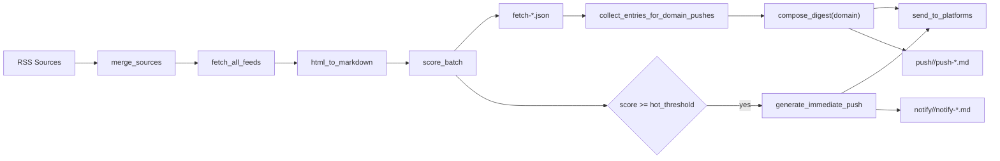

# 技术架构

## 核心架构

AI Daily 使用两个长期运行的异步循环：

- **Fetch Loop**：按固定间隔抓取 RSS，转换内容、批量评分、保存抓取结果，并处理高分即时推送。
- **Push Loop**：按 `schedule.push_cron` 计算下一次触发时间，按 domain 生成定时汇总并推送。
- **Source Sync Loop**：按 `sources.sync.cron` 每周拉取远端 OPML，合并去重后替换本地 `resources/rss.opml`。

```text
┌──────────────────────────────────────────────────────────────┐
│                     Config (config.yaml)                     │
├──────────────────────────────────────────────────────────────┤
│ sources        filter        schedule       llm/prompts/push │
│ base_opml      min_score     fetch interval domain prompts   │
│ add/block      threshold     push_cron      platforms        │
└──────────────────────────────────────────────────────────────┘
                            │
           ┌────────────────┴────────────────┐
           ▼                                 ▼
┌─────────────────────┐           ┌─────────────────────┐
│ Fetch Loop          │           │ Push Loop           │
│ fixed interval      │           │ croniter schedule   │
│                     │           │                     │
│ - fetch RSS         │           │ - collect entries   │
│ - HTML to Markdown  │           │ - group by domain   │
│ - score batch       │           │ - compose digest    │
│ - instant push      │           │ - push and archive  │
└─────────────────────┘           └─────────────────────┘
           │                                 │
           └────────────────┬────────────────┘
                            ▼
                 ┌─────────────────────┐
                 │ news-data/          │
                 │ fetch-*.json        │
                 │ notify/<domain>/*.md│
                 │ push/<domain>/*.md  │
                 └─────────────────────┘
```

## 数据流


```mermaid
flowchart LR
    A["RSS Sources"] --> B["merge_sources"]
    B --> C["fetch_all_feeds"]
    C --> D["html_to_markdown"]
    D --> E["score_batch"]
    E --> F["fetch-*.json"]
    E --> G{"score >= hot_threshold"}
    G -->|yes| H["generate_immediate_push"]
    H --> I["send_to_platforms"]
    H --> J["notify/<domain>/notify-*.md"]
    F --> K["collect_entries_for_domain_pushes"]
    K --> L["compose_digest(domain)"]
    L --> I
    L --> M["push/<domain>/push-*.md"]
```

## 关键模块

### `src/main.py`

职责：

- 加载 `.env` 和 `config.yaml`
- 启动前调用 `check_llm_available()` 检查 LLM 可用性
- 并发启动 `fetch_loop()` 和 `push_loop()`
- 统一处理 LLM 异常通知

关键流程：

```python
initialize_config()
await check_llm_available()
await asyncio.gather(fetch_loop(), push_loop())
```

`run_fetch_job()`：

1. 每轮开始移除距被拒时间达到或超过 `dedupe.rejected_ttl_hours` 的内存记录，并根据 `fetch_interval_minutes` 和 `fetch_lookback_minutes` 计算 UTC 抓取窗口。
2. 合并 OPML 与自定义源，应用 `block` 和 `block_domains`。
3. 并发抓取 RSS，转换 HTML 为 Markdown。
4. 在精确、模糊去重前跳过有效期内的被拒链接；去重日志分别统计被拒跳过、精确去重和模糊去重数。
5. 调用 `score_batch()` 分领域批量评分，取得 `(scored, rejected_links)`。
6. 过滤未配置 domain 的评分结果，将这些链接并入被拒记录，以本轮评分完成的 UTC 时间记录；其余结果保存到 `news-data/fetch-YYYY-MM-DD.json`。
7. 对达到 `hot_threshold` 的条目按 domain 生成即时快讯，推送并追加到 `notify/<domain>/notify-YYYY-MM-DD.md`。

被拒记录使用模块级 `_rejected_links` 字典，仅保存链接与被拒时间；评分失败批次和已入库条目不记录。过期链接再次评分后仍被拒时，时间刷新为本轮评分完成时间。进程重启后记录清空，第一轮对抓取到的新条目照常评分；记录不写入 fetch 或其他本地文件，fetch 文件结构不变。`fetch_loop()` 串行执行抓取任务，无需为该字典加锁。

`run_push_job()`：

1. 调用 `collect_entries_for_domain_pushes()` 按 domain 收集候选内容。
2. 每个 domain 独立读取上次 push 时间，并以 24 小时窗口作为兜底边界。
3. 加载该 domain 近期 push 标题作为查重上下文。
4. 调用 `compose_digest(..., domain=domain)` 使用 domain 专属 prompt 生成汇总。
5. 推送到启用平台，并保存到 `news-data/push/<domain>/push-*.md`。

### `src/config.py`

职责：

- 用 Pydantic 模型描述整份配置：`AppConfig` 是根模型，下辖 `FilterConfig`、`DedupeConfig`、`ScheduleConfig`、`FetchConfig`、`LLMConfig`、`PushConfig`、`SourcesConfig`。
- `load_config()` 用 `yaml.safe_load()` 读取 `config.yaml`，再交给 `AppConfig.model_validate()` 校验，返回类型化对象，业务代码统一用属性访问（`config.llm.models`、`config.llm.fallback`、`config.llm.model_for(tier)`）。
- `initialize_config()` 在启动时只加载一次并保存全局只读 `AppConfig`；`get_config()` 在业务模块中读取它，避免配置对象沿调用链传递。
- `get_timezone()` 只从已初始化的全局配置读取时区。
- `parse_opml()` 解析 OPML 订阅源。
- `merge_sources()` 合并 `base_opml + add - block`，并按 `xmlUrl` 去重。
- `source_sync.sync_opml_sources()` 下载 `sources.sync.urls` 中的远端 OPML，解析 RSS outline，按 `xmlUrl` 去重，并在所有远端源都成功时原子替换 `base_opml`。
- `block_domains` 支持 `*.substack.com` 形式，也支持 `fnmatch` 通配。
- `get_timezone()` 使用必填的 `schedule.timezone_hours`，不会回退到系统本地时区。

### `src/fetcher.py`

职责：

- 使用 `aiohttp` 并发抓取 RSS。
- 使用浏览器风格请求头降低 403 概率。
- 使用 `feedparser` 解析条目。
- RSS 时间统一解析为 UTC `datetime`，抓取过滤也基于 UTC。

输出条目基础结构：

```json
{
  "title": "无标题",
  "link": "",
  "published": "datetime",
  "source": "Feed Title",
  "content": "",
  "tags": [],
  "score": 0,
  "summary": ""
}
```

### `src/processor.py`

职责：

- 使用 `markdownify` 把 RSS HTML 正文转 Markdown。
- 根据原始链接补全相对链接和图片地址。
- 移除 `xgo.ing` 推广链接。
- 清理多余空行。
- 提供 `clean_for_llm`：在构造 LLM 输入（评分、定时汇总、即时快讯）时移除图片标记、推广签名与导购链接并压缩空行；只删噪音、不改写语义，存盘原始内容与 `link` 字段不受影响。

### `src/llm.py`

LLM 调用统一使用 OpenAI 兼容接口：

```python
url = f"{base_url}/chat/completions"
payload = {
    "model": config.model_for(tier),
    "messages": [{"role": "user", "content": prompt}],
    "temperature": 0.3,
}
```

`call_llm(prompt, tier, response_format=None, allow_fallback=True)` 支持：

- 从 `apiKeyName` 指定的环境变量读取密钥。
- 必填 `tier` 参数（`ModelTier` 枚举）决定使用哪一档模型，无默认值；调用点必须显式声明档位。
- 通过可选 `response_format` 透传 OpenAI 兼容 JSON mode 等结构化输出配置。
- `max_retries` 控制主模型的总尝试次数，包含首次请求；重试始终使用同一主模型。
- 主模型的 `asyncio.TimeoutError` 与 `aiohttp.ClientError`（包括 `aiohttp.ServerTimeoutError`）和可重试 HTTP 状态码使用相同的指数退避策略。异常触发的重试日志包含异常类型名和当前重试序号，状态码触发的日志沿用原格式；退避间隔和 `max_retries` 配置不变。
- `401`、`404` 等不可重试状态码立刻结束主模型尝试；其他异常（例如响应缺少 `choices` 引起的 `KeyError`）直接抛出，不进入超时与网络重试路径。请求未设置额外超时时长，沿用 aiohttp `ClientSession` 默认总超时 300 秒。
- `allow_fallback` 默认开启。主模型按上述策略失败后，若配置了 `llm.fallback`，再用该端点的 `baseUrl` / API Key / `model` 请求恰好一次；成功则打日志（档位、两边型号、两边地址）。兜底超时或网络异常直接抛出该次异常，不对兜底重试；未配置或未允许兜底时，主模型持续超时或网络异常会抛出最后一次尝试的原异常。主模型缺 Key 仍在入口失败且不打兜底；兜底缺 Key 在发出该次请求前以同样方式失败。启动探测传入 `allow_fallback=False`。

**失败日志与通知**：评分批次（`_score_single_batch()`）、即时快讯（`generate_immediate_push()`）和汇总（`run_push_job()`）统一使用 `异常类型名: 消息`，即 `{type(e).__name__}: {e}`。异常消息为空时仍包含类型名（例如 `TimeoutError: `）；评分 JSON 解析失败包含 `ValueError` 及原解析错误消息。即时快讯返回的 `error_message` 和汇总异常通知复用相同的错误文本，与日志一致。

**用量日志**：每个 HTTP 200 且响应 JSON 解析成功的请求，在读取正文前向标准输出打印一条日志，不创建或追加本地 usage 文件：

```text
LLM usage | tier=low | model=<实际请求模型> | usage={"prompt_tokens":100,"completion_tokens":20,"total_tokens":120}
```

`usage` 使用紧凑 JSON 原样保留供应商字段及嵌套明细（包括缓存、推理和扩展字段）；缺失或显式 `null` 输出 `usage=null`，明确返回的零值保留为零。兜底响应记录实际请求的兜底模型名，档位保持原调用档位。日志不包含 prompt、正文、密钥或完整响应，不改变请求、正文返回值、重试及兜底行为。

启动探测同样输出用量；评分正文解析失败也会保留此前已输出的用量。非 HTTP 200、网络异常和响应 JSON 解析失败不产生该日志，未知消耗不能算作零，因此日志求和仅代表可观测响应，并非完整账单。评分与即时快讯都使用 `low`，仅凭档位不能精确区分业务阶段。

**模型档位**

`llm.models` 声明 `low` / `medium` / `high` 三档模型名，三档必须齐全。各档共用同一组接口参数（`baseUrl`、`apiKeyName`、`max_retries`），上下文额度（`max_prompt_chars`、`digest_max_input_tokens`）保持全局，不随档位变化——因此分批与裁剪逻辑无需感知档位。

`llm.fallback` 是可选的独立兜底端点，写在 `models` 外面，三档共用，必须自带 `model`、`baseUrl`、`apiKeyName`，不继承主接口。未写该项时行为与未配置兜底时一致。已声明则主模型失败后会打，不因型号或接口与主模型相同而跳过。

档位分配依据实测加权成本（定时汇总约 63%、评分约 22%、即时快讯约 15%）：

| 调用点 | 档位 | 理由 |
| --- | --- | --- |
| `score_batch()` | `low` | 输出为紧凑 JSON 且仅供内部消费，降档近乎无损 |
| `generate_immediate_push()` | `low` | 成本占比最小、输出为短文；已用真实热点数据验证格式与无新内容标记 |
| `compose_digest()` | `medium` | 唯一的长文成品输出 |
| 无 | `high` | 预留升档位，汇总质量不足时切换 |

档位是意图，模型名是实现：换模型只改配置，换档位才改代码。

**不做自动降档**：调用失败时不会改用其他档位的主模型完成该次调用。汇总与快讯直接推送给用户且不可撤回，静默降档会让推送质量在用户无感知的情况下波动。

**独立兜底端点**：这与降档是两件事。主模型按既有重试策略失败后，可以改打 `llm.fallback` 声明的另一套地址、凭据和型号，档位不变。进程不粘滞，下一次调用仍先打该档主模型。切换成功只打日志，不发异常通知。

`check_llm_available()` 在启动时并发探测全部三档主模型，沿用 `startup_timeout_seconds` 作为单档超时，探测关闭兜底。探测响应按上述规则输出用量日志，三档均成功时返回（无返回值）；任一档失败或超时即抛错中断启动，错误信息包含失败档位名与原因，多档失败时列出全部失败档位。已配置 `fallback` 也不能把失败的档标为可用。

`score_batch(entries)`：

1. 读取 `prompts.score_batch`。
2. 从 `prompts.domains` 的键构建有序的可选领域列表。
3. 读取启用 domain 的 `score_standard`，拼进评分 prompt。
4. 根据 `max_prompt_chars` 自动分批，当前配置为 30000 字符。
5. 使用 `max_concurrent_batches` 控制并发。
6. 评分调用传入 `response_format={"type": "json_object"}`；prompt 要求单行、无缩进、无换行的 JSON 对象且不含其他文字，字段顺序为 `id`、`domain`、`score`、`tags`、`summary`，仅声明一次 JSON 输出要求。解析优先接受 `{"items": [...]}`，并兼容缩进、换行输出及旧式顶层 JSON 数组，字段含义不变。
7. `_score_single_batch()` 成功时返回结果列表（可为空），失败时返回 `None`；仅合并成功批次中的可匹配结果，并把这些批次里模型未返回结果的条目链接记为被拒。
8. 返回 `(scored, rejected_links)`，失败批次不产生被拒链接；“评分过滤链接”日志只统计成功批次。调用方再追加未配置 domain 的链接，并记录被拒时间。

`generate_immediate_push()`：

- 必须传入 `domain`。
- 通过 `llm.prompts.domains.<domain>.immediate_push` 查找 domain 专属即时推送 prompt。
- 传入本次热点条目和近期 notify/push 标题。
- 待推送条目会移除 `summary` 字段；当 `content` 为空时，用评分阶段生成的 `summary` 补充到 `content`。
- 失败时返回空内容和错误信息，由调用方告警并跳过本次即时推送。

`compose_digest()`：

- 必须传入 `domain`。
- 通过 `llm.prompts.domains.<domain>.digest` 查找 domain 专属汇总 prompt。
- 未配置对应 digest 时直接报错。
- 传入待推送条目、历史上下文和近期 push 标题；待推送条目同样会移除 `summary` 字段，并在正文为空时用 `summary` 补充 `content`。

### `src/storage.py`

主要文件：

| 文件 | 说明 |
|------|------|
| `news-data/fetch-YYYY-MM-DD.json` | 当天抓取和评分结果 |
| `news-data/notify/<domain>/notify-YYYY-MM-DD.md` | 当天即时推送内容，按 domain 分目录并按块追加 |
| `news-data/push/<domain>/push-YYYY-MM-DD-HH-MM-SS.md` | 定时汇总推送归档 |

`fetch-*.json` 格式：

```json
{
  "meta": { "date": "2026-05-26" },
  "entries": [
    {
      "title": "...",
      "link": "...",
      "published": "...",
      "fetched_at": "...",
      "source": "...",
      "content": "...",
      "tags": ["..."],
      "domain": "AI",
      "score": 85,
      "summary": "..."
    }
  ]
}
```

`push-*.md` frontmatter：

```yaml
---
pushDate: "2026-05-26T16:40:05+08:00"
domain: "AI"
sourceCount: 8
totalEntries: 8
---
```

去重与上下文：

- `load_existing_links()` 在跨天边界会读取昨天和今天的 fetch 文件，降低重复抓取。
- `load_recent_notify_titles()` 按 domain 只提取即时推送标题供 LLM 查重。
- `load_recent_push_titles()` 只提取历史汇总标题供 LLM 查重。
- 传给 LLM 的历史推送上下文是标题清单，不把完整成品文案传回去模仿。

### `src/push/`

平台注册入口是 `create_platform()`：

```python
platforms = {
    "discord": DiscordPlatform,
    "feishu": FeishuPlatform,
    "gmail": GmailPlatform,
}
```

| 平台 | 行为 |
|------|------|
| Discord | Webhook 发送纯文本，按 2000 字符切分 |
| 飞书 | 发送 V2 interactive card，Markdown 元素按 8000 字符切分 |
| Gmail | SMTP 发送 `multipart/alternative` 邮件，Markdown + HTML 双正文；端点固定 `smtp.gmail.com:587` STARTTLS |

`send_to_platforms()` 从全局 `AppConfig` 遍历 `push_config.enabled_platforms()`，只发送到 `enabled=true` 的平台；`create_platform()` 在平台所需环境变量缺失时返回 `None` 并跳过。单个平台失败只打印错误，不中断其他平台。

## 配置详解

配置文件是根目录的 `config.yaml`，由 `load_config()` 用 `yaml.safe_load()` 读取，并用 Pydantic 模型 `AppConfig` 校验。

校验规则：

- 除 `llm.fallback` 外，所有字段都是必填，代码中不设默认值，配置里缺什么就报什么。
- 禁止未知字段（`extra="forbid"`），拼错的键名会直接报错而不是被忽略。
- 值域约束：分数类字段限定 `0-100`，时长与并发类字段必须大于 0，`timezone_hours` 限定 `-12` 到 `14`。
- `dedupe.rejected_ttl_hours` 是必填 `PositiveInt`，单位为小时，缺失或非正整数会校验失败；代码不设默认值，当前部署配置写为 `24`。
- 语义约束：`hot_threshold` 不得低于 `min_score`；`push_cron` 与 `sources.sync.cron` 必须是合法 cron；`hot_push_block_periods` 每段起始时间必须早于结束时间；`llm.baseUrl`、`llm.fallback.baseUrl`、`sources.add[].xmlUrl`、`sources.sync.urls` 必须是 http/https URL；`llm.models` 必须齐备 `low`、`medium`、`high` 三档且模型名非空；`llm.fallback` 可选，写了就必须含非空的 `model`、`baseUrl`、`apiKeyName`，且不进 `models` 字典；`prompts.domains` 必须至少声明一个领域，且每个领域必须配好三类 prompt；`sources.sync.enabled=true` 时 `urls` 不能为空。
- 初始化时还会解析相对路径并检查 prompt 与 `base_opml` 文件可读，避免进入循环后才失败。

配置文件缺失、YAML 语法错误、顶层不是映射，或任一字段校验失败时，`load_config()` 会用 `logging` 打印失败原因和逐条问题位置，然后 `sys.exit(1)` 退出，不进入主流程。

顶层结构：

```yaml
filter:
  min_score: 60
  hot_threshold: 90
  context_days: 2
  keep_days: 7
  push_context_days: 5
  no_content_marker: "[NO_NEW_CONTENT]"

dedupe:
  fuzzy_enabled: false
  content_threshold: 90
  rejected_ttl_hours: 24   # 被拒链接的内存记录有效期，正整数小时

schedule:
  fetch_interval_minutes: 120
  fetch_lookback_minutes: 180
  push_cron:
    - "30 9 * * *"
  hot_push_block_periods:
    - ["01:00", "09:31"]
  timezone_hours: 8

fetch:
  max_workers: 10
  timeout: 10
llm:
  provider: openai
  models:                             # 档位 -> 模型名；三档必须齐全
    low: gpt-5.4                      # 评分、即时快讯
    medium: gpt-5.6-luna              # 定时汇总
    high: gpt-5.6-sol                 # 预留升档位，当前无调用点
  fallback:                           # 可选；独立兜底端点，须自带型号、地址和 Key 名
    model: grok-4.5
    baseUrl: https://openrouter.ai/api/v1
    apiKeyName: OPENROUTER_API_KEY
  baseUrl: https://www.rightapi.ai/codex/v1
  apiKeyName: RIGHT_CODE_API_KEY
  max_prompt_chars: 30000
  digest_max_input_tokens: 450000
  max_concurrent_batches: 3
  max_retries: 3
  startup_timeout_seconds: 15
  prompts:
    domains:
      AI:
        score_standard: prompts/score/ai/score_standard.md
        digest: prompts/digest/ai/digest.md
        immediate_push: prompts/immediate/ai/immediate_push.md
      Investment:
        score_standard: prompts/score/investment/score_standard.md
        digest: prompts/digest/investment/digest.md
        immediate_push: prompts/immediate/investment/immediate_push.md
    score_batch: prompts/score/score_batch.md
push:
  discord:
    enabled: false
    apiKeyName: DISCORD_WEBHOOK_URL
  feishu:
    enabled: false
    apiKeyName: FEISHU_WEBHOOK_URL
  gmail:
    enabled: true
    usernameKeyName: GMAIL_USERNAME
    passwordKeyName: GMAIL_APP_PASSWORD
    toKeyName: GMAIL_TO
    fromName: AI Daily

sources:
  base_opml: resources/rss.opml
  sync:                 # 每周拉取远端 OPML 覆盖 base_opml
    enabled: true
    cron: "0 4 * * 0"
    backup: true
    timeout: 30
    title: AI Daily RSS Sources
    urls:
      - https://raw.githubusercontent.com/.../feeds.opml
  add:                  # 自定义补充源
    - title: OpenAI News
      xmlUrl: https://openai.com/news/rss.xml
      category: AI
  block:                # 按 xmlUrl 屏蔽
    - xmlUrl: https://dev.to/feed
    - xmlUrl: http://engineering.khanacademy.org/rss
    - xmlUrl: https://browser.engineering/rss.xml
  block_domains:        # 按域名屏蔽，支持 *.example.com
    - "*.youtube.com"
```

`sources.block` 按 RSS 的 `xmlUrl` 精确匹配。新增的 `http://engineering.khanacademy.org/rss` 和 `https://browser.engineering/rss.xml` 与 `resources/rss.opml` 中的地址完全一致，用于屏蔽发布日期无效或缺失、导致旧条目重复评分的两个源。

### 环境变量

| 配置项 | 环境变量示例 | 说明 |
|--------|--------------|------|
| LLM API Key | `OPENAI_API_KEY` | 由 `llm.apiKeyName` 指定，可改成任意变量名 |
| 兜底 LLM API Key | `OPENROUTER_API_KEY` | 由 `llm.fallback.apiKeyName` 指定；未配置兜底时可省略 |
| Discord Webhook | `DISCORD_WEBHOOK_URL` | 由 `push.discord.apiKeyName` 指定 |
| 飞书 Webhook | `FEISHU_WEBHOOK_URL` | 由 `push.feishu.apiKeyName` 指定 |
| Gmail 发件账号 | `GMAIL_USERNAME` | 由 `push.gmail.usernameKeyName` 指定 |
| Gmail App Password | `GMAIL_APP_PASSWORD` | 由 `push.gmail.passwordKeyName` 指定 |
| Gmail 收件人 | `GMAIL_TO` | 由 `push.gmail.toKeyName` 指定，支持逗号分隔多个地址 |

## 目录结构

```text
ai-daily/
├── src/
│   ├── main.py
│   ├── config.py
│   ├── fetcher.py
│   ├── llm.py
│   ├── processor.py
│   ├── storage.py
│   └── push/
│       ├── __init__.py
│       ├── base.py
│       ├── discord.py
│       ├── feishu.py
│       └── gmail.py
├── prompts/
│   ├── immediate/
│   │   ├── ai/immediate_push.md
│   │   └── investment/immediate_push.md
│   ├── score/
│   │   ├── score_batch.md
│   │   ├── ai/score_standard.md
│   │   └── investment/score_standard.md
│   └── digest/
│       ├── ai/digest.md
│       └── investment/digest.md
├── tests/
│   └── test_flow.py
├── resources/
│   └── rss.opml
├── news-data/
│   ├── fetch-*.json
│   ├── notify/<domain>/notify-*.md
│   └── push/<domain>/push-*.md
├── config.yaml
├── requirements.txt
├── Dockerfile
└── docker-compose.yml
```

## 扩展指南

### 添加新推送平台

1. 在 `src/push/` 创建新文件。
2. 继承 `PushPlatform`。
3. 实现 `validate_config()` 和 `send()`。
4. 在 `src/push/__init__.py` 的 `create_platform()` 中注册。

### 添加新 domain

1. 新增评分标准文件，例如 `prompts/score/<domain>/score_standard.md`。
2. 新增摘要 prompt，例如 `prompts/digest/<domain>/digest.md`。
3. 新增即时推送 prompt，例如 `prompts/immediate/<domain>/immediate_push.md`。
4. 在 `config.yaml` 的 `llm.prompts.domains` 中以领域名为键添加配置；该领域随即启用，声明位置决定处理顺序。

### 添加新源

编辑 `config.yaml` 的 `sources.add` 列表。需要屏蔽源时优先使用 `sources.block` 或 `sources.block_domains`，避免直接改 OPML。

## 测试指南

```bash
pytest tests/test_flow.py -v
```

`tests/test_flow.py` 默认读取根目录 `config.yaml`，保持测试和真实配置接口一致。它覆盖主流程中的主要步骤：

| 步骤 | 测试内容 |
|------|----------|
| 配置 | 真实 `config.yaml` 能通过模型校验，启用 domain 的 prompt 文件可访问 |
| 配置容错 | 文件缺失、YAML 非法、缺少字段、值越界、未知字段时 `load_config()` 退出并打印错误日志 |
| 抓取前处理 | 合并 RSS 源、去重、屏蔽源、HTML 转 Markdown |
| LLM 评分 | 使用 fake LLM 返回 JSON，验证评分、domain、summary 合并 |
| Digest | 使用 fake LLM 验证 domain digest prompt 可调用 |
| 存储和筛选 | 写入临时 fetch 文件，再按分数、domain、时间筛出待推送和上下文 |
| 推送 | 基于 `config.yaml` 的 Gmail 配置构建邮件消息，不发送真实邮件 |
| Push Job | 用指定 fetch 文件驱动完整 `run_push_job()`，验证 digest 生成和 push 文件落盘 |

真实服务测试默认关闭。需要调试时直接改 `tests/test_flow.py` 顶部变量：

```python
RUN_REAL_RSS_FETCH = True
RUN_REAL_LLM_SCORE = True
RUN_REAL_LLM_DIGEST = True
RUN_REAL_PUSH = True
DEBUG_DOMAIN = "AI"
```

### 用指定 fetch 文件跑 run_push_job

`run_push_job_with_fetch_file(fetch_file, monkeypatch, data_dir, restamp=True, send_push=False)` 是 `tests/test_flow.py` 中的调试辅助方法：

1. 读取传入的 fetch JSON（相对路径按仓库根目录解析）
2. 默认把每条 `fetched_at` 重写为当前时间，绕过 `push_cutoff` 让历史条目全部进入待推送集合
3. 写入 `data_dir` 下的当天 fetch 文件，并把 `collect_entries_for_domain_pushes`、`load_recent_push_titles`、`get_push_file` 重定向到该目录
4. 执行 `run_push_job()`，返回本次生成的 push 文件路径列表

`send_push=False`（默认）时 `send_to_platforms` 被替换为打印，不发送真实消息。两个入口：

- `test_run_push_job_from_fetch_file`：fake `compose_digest`，常规回归用例，随测试套件执行
- `test_debug_real_push_job_from_fetch_file`：走真实 LLM digest，由 `RUN_REAL_PUSH_JOB` 和 `DEBUG_FETCH_FILE` 控制，默认跳过
